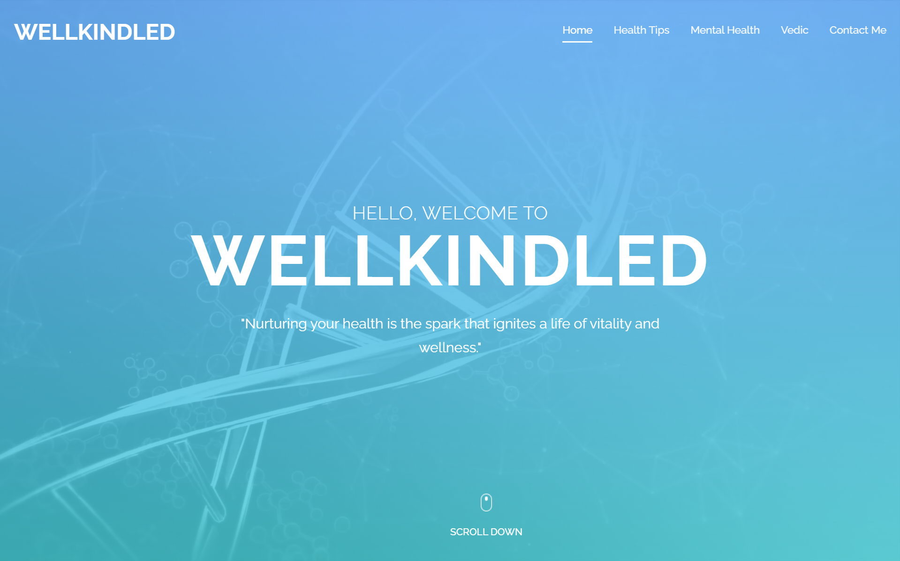

# WELLKINDLED

  

**WELLKINDLED** is a simple healthcare blog with **Vedic**, an AI-powered chatbot built using **Python** and **Flask**. The chatbot answers basic health-related questions using a custom JSON knowledge base.

---

## 🚀 Features

- 🩺 Healthcare blog sections with general health and mental wellness tips.
- 🤖 **Vedic** chatbot:
  - Loads a local JSON knowledge base.
  - Uses Python’s `difflib` for fuzzy matching to find similar questions.
  - Picks a random answer from possible responses.
  - Can learn new answers when run in terminal mode.
- 💻 Clean, responsive web interface using **HTML**, **CSS**, and **JavaScript**.
- ✨ Smooth slide-up animations for new chat messages.

---

## 📂 Project Structure

wellkindled/
├── app.py
├── chatbot.py
├── database.json
├── templates/
│ └── index.html
└── static/
├── css/
├── js/
├── images/

---

## ⚙️ How to Run Locally

1. Clone the repository:
git clone https://github.com/abhie021/Wellkindled.git
cd wellkindled

2. (Optional) Create a virtual environment:
python -m venv venv
source venv/bin/activate # Linux/macOS
venv\Scripts\activate # Windows

3. Install dependencies:
pip install Flask

4. Run the app:
python app.py

5. Open [http://127.0.0.1:5000](http://127.0.0.1:5000) in your browser.

---

## 🧩 Chatbot Logic

- Loads `database.json` with predefined questions and answers.
- Uses `difflib.get_close_matches` to find the closest matching question.
- Returns a random matching answer.
- If no match is found (in terminal mode), the user can teach it a new response, which gets saved to the JSON file.

---

## ⚠️ Disclaimer

This project is for **showcase and educational purposes only**.  
The chatbot’s information is based on general health tips from external sources and does **not** constitute professional medical advice.

---

## 📌 Author

**Hemant Murkute**

---

## 📖 License

Open source for learning and demonstration.
